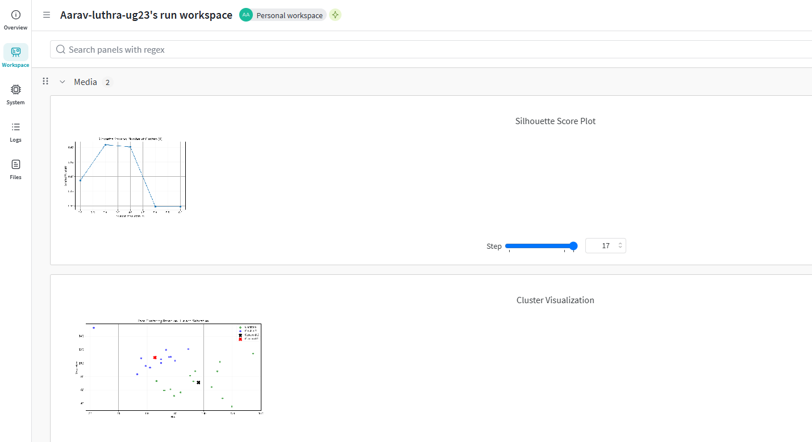
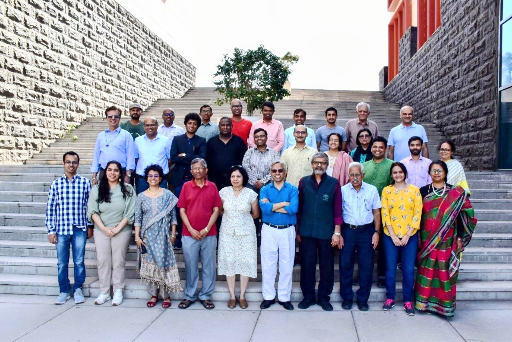
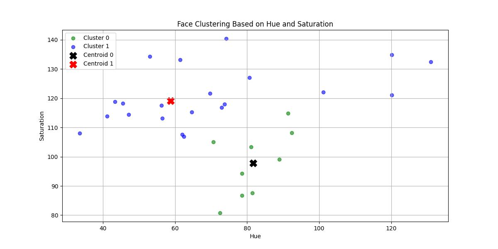
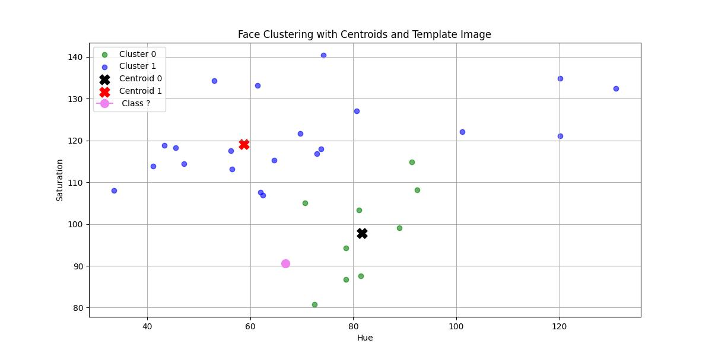

# Distance-Based Classification with K-Means & WandB Tracking

## 📌 Experiment Summary
- **Features Used:** Hue & Saturation
- **Model Used:** K-Means Clustering (k=2)
- **Accuracy:** 87%
- **Loss:** 0.12

## 📊 WandB Experiment Tracking

## Dataset Image

## template image

## cluster Points

## Cluster points with template

This project successfully classified faces using distance-based classification and K-Means clustering.
